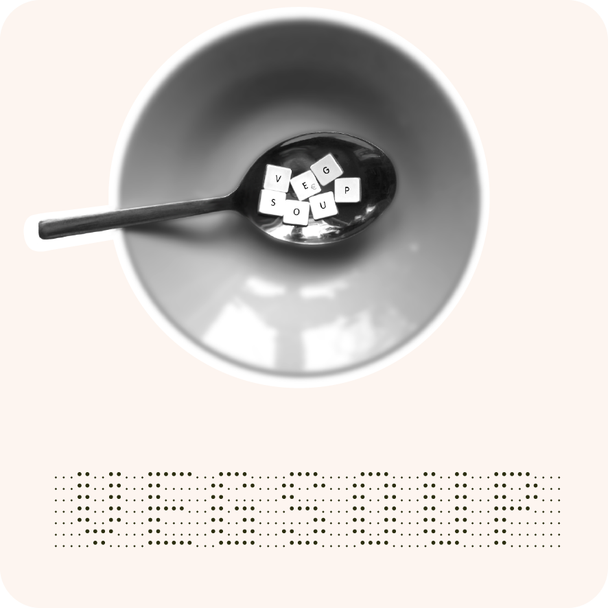

About this reference list
=========================

This is a work in progress list of vascular plants, bryophytes and lichens for Austria (and neighboring countries).
It is aimed to be extended/modified as needed. The taxonomic concept is up to date (see below) and is based on the perspective of Austrian's taxonomic authorities.

Species concepts
----------------

Concerning vascular plants we stick to the species concept of Fischer et al. (2008).
Currently the list contains all vascular plant taxa known to occur in Upper Austria based on the checklist of Hohla et al. (2009), plus several species from the remaining states of Austria (mainly Salzburg, Tyrol, and Lower Austria).
The taxonomy of lichens follows Türk & Hafellner (2010).
Byrophytes are treated according to the [Checklist of Austrian Bryophytes](http://131.130.59.133/projekte/moose/) (Köckinger et. al.).
The species concept for taxa of any group that do not occur in Austria follows the [ThePlantList](http://www.theplantlist.org).
If present, we use the subspecific rank of a species regardless if this taxon is monospecific for Austria (cp. Jansen and Dengler, 2010).
As an example we treat *Allium ursinum* as *Allium ursinum* ssp. *ursinum* as to differentiate it against *Allium ursinum* subsp. *ucrainicum*.
Note, Fischer et al. 2008 is not overly consistent in using *s.str.* (sensu stricto).
We use the full subspecific epithethon with the nominate subspecies instead of using s.str..
Species aggregates are intrepreted as defined in the »Ehrendorfer list« (Guttermann & Niklfeld, 1973).

Red list status
---------------

As a legacy of Hohla et al. (2009) the list contains the red list status from the original source (supplied by M. Hohla, Reichsberg). There is also a red list status for Salzburg according to Wittmann et al. (1991), although this treatment can be considered outdated.

Meaning of columns
------------------

- **level**: One of vascular plants, bryophytes, or lichens
- **family**: Treatment of families is based on the [ThePlantList](http://www.theplantlist.org) queried by genus.
- **abbr**: This is the primary key (see below)
- **taxon**: Scientific taxon names (excluding scientific author names)
- **authority**: Species concept
- **synonyms**: Some common synonyms (very scrappy)
- **vernacular.name**: German names according to Fischer et al. (2008)
- **rl.aut**: Red List status for Austria (incomplete)
- **rl.sbg**: Red List status for the state of Salzburg (Austria)
- **law.sbg**: Legal protection for the state of Salzburg (Austria) according to LGBl Nr. 18/2001
- **rl.oö**: Red List status for the state of Upper Austria (Austria)
- **rl.oö.bm**: Regional red list status for the Bohemian Massif region (Upper Austria)
- **rl.oö.av**: Regional red list status for the pre alpine lowlands (Upper Austria)
- **rl.oö.97**: Former red list status (1997) (depreciated)
- **law.oö**: Legal protection for the state of Upper Austria (Austria) according to LGBl. Nr. 73/2003
- **endemic.aut**: Endemic of Austria (E: strict endemic, S: subendemic)
- **alien**: Alien species

Further details about specific columns
--------------------------------------

**abbr** (abbreviation) is the primary key to query against this list (see the [vegsoup-data](https://github.com/kardinal-eros/vegsoup-data) repository).  

There is a long tradition in biodiversity data sets to use a lettercode instead of nondescript numbers (eg. CEP-names of Cornell Ecology Programs).
The general algorithm applied here to construct unique character strings for each taxon is as follows: Take the first 4 letters of the genus and species (*Bellis perennis* equals `bell pere`).
If there is a subspecific taxon, pad the 4 + 4 code with the first 4 letters of the subspecific epitheton, resulting in a 4 + 4 + 4 code (*Dactylis glomerata* ssp. *glomerata* equals `dact glom glom`).
Note, we don't code the type of subspecific rank here (in the previous example a subspecies).
In order to prevent overlaps for some taxa (eg. Galeopsis speciosa and Galeopsis sp.) we use `spec ies` instead of `spec` for taxa that are determined only at the level of genus.
In some rare cases the genus has to be extended by another 4 letters (in this case the last 4 letters of the genus) to make it unique.
Consider the following two species as an example. *Euphorbia* sp. `euph rbia spec ies` versus *Euphrasia* sp. `euph asia spec ies`.

<!---
The codes used in column `law.sbg` (protection by law of the state of Salzburg) are as follows.

- **A**: Richtliniengeschützte Pflanzenarten im Land Salzburg
- **B**: Andere vollkommen geschützte Pflanzenarten im Land Salzburg
- **C**: Andere vollkommen geschützte Pflanzenarten im Bezirk Salzburg-Umgebung und in der Stadt Salzburg
- **D**: Teilweise geschützte Pflanzenarten in Salzburg
-->

References
----------

MA Fischer, K Oswald, and W Adler. Exkursionsflora für Österreich, Liechtenstein und Südtirol, volume 3. Biologiezentrum der Oberösterreichischen Landdesmuseen, 2008.

M Hohla, O Stöhr, G Brandstätter, J Danner, W Diewald, F Essl, H Fiereder, F Grims, F Höglinger, G Kleesadl, A. Kraml, F Lenglachner, A Lugmair, K Nadler, H Niklfeld, A Schmalzer, L Schratt-Ehrendorfer, C Schröck, M Strauch, and H Wittmann,  (2009). *Katalog und Rote Liste der Gefäßpflanzen Oberösterreichs*. In Stapfia, volume 91, pages 324. Biologiezentrum der Oberösterreichischen Landesmuseen.

W Guttermann and H Niklfeld (1973). *Liste der Gefäßpflanzen Mitteleuropas*, volume 2 (Ehrendorfer, F editor). Gustav Fischer Verlag, Stuttgart.

F Jansen and F Dengler (2010). *Plant names in vegetation databases - a neglected source of bias*. Journal of Vegetation Science, 21(6):1179–1186.

R Türk and J Hafellner (2010). *Nachtrag zur Bibliographie der Flechten in Österreich*. In Ehrendorfer, F (editor), Biosystematics and Ecology Series, volume 27. Austrian Academy of Sciences Press.

H Köckinger, C Schröck, R Krisai and HG Zechmeister (2012). [*Checklist of Austrian Bryophytes*](http://131.130.59.133/projekte/moose/)

Wittmann, H, Pilsl P, and G Nowotny (1991). *Rote Liste gefährdeter Farn- und Blütenpflanzen des Bundeslandes Salzburg*. In Naturschutzbeiträge, volume 8/96, Amt der Salzburger Landesregierung, Naturschutzreferat, Salzburg.

LGBl Nr. 18/2001. *Verordnung der Salzburger Landesregierung vom 29. Jänner 2001 über den Schutz bestimmter wild wachsender Pflanzen in der freien Natur und den Schutz frei lebender Tierarten (Pflanzen- und Tierarten-Schutzverordnung)*

LGBl. Nr. 73/2003. *OÖ Artenschutzverordnung 2003* (idgF.)